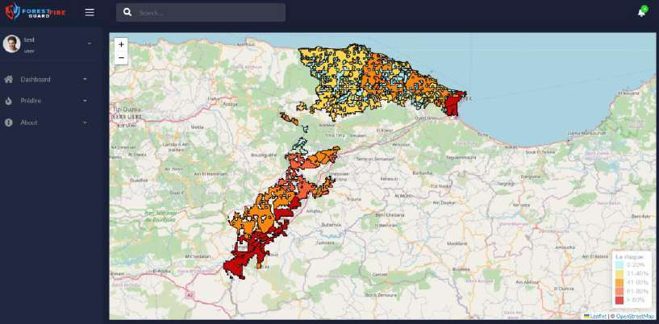
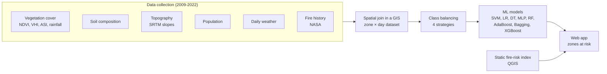
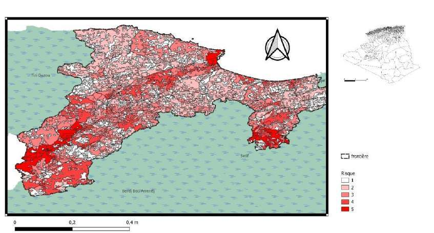
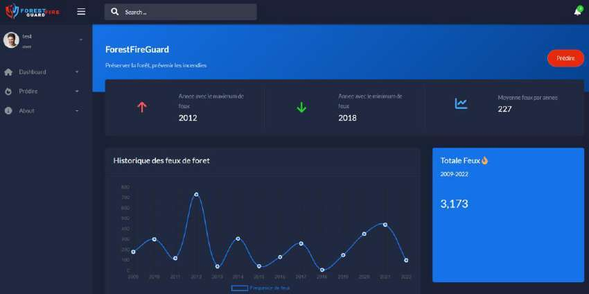

# Forest Fire Prediction in Béjaïa with Machine Learning

Forest fires cause major damage in northern Algeria every summer. This project predicts **where and when forest fires are likely to start in the wilaya of Béjaïa** (Kabylie, Algeria). It combines geospatial and daily weather data with machine learning, then maps the risk with a GIS fire-risk index in a web application.

> 🎓 Bachelor's final-year project (Licence ISIL, Computer Science), **USTHB**, Algiers, defended on 4 June 2024
> Team: **Wafaa Berrais** & **Douaa Boutehra** · Supervisors: Brahim Bessaa & Karim Atif
> Full thesis (French): [`docs/thesis_fr.pdf`](docs/thesis_fr.pdf)

<p align="center">
  
  <br/><em>ForestFireGuard web app: zones predicted at risk, coloured by fire-risk index.</em>
</p>

---

## Overview



## Data

We built our own dataset for Béjaïa by combining open geospatial and weather sources in a GIS:

| Family | Features | Source |
|---|---|---|
| Vegetation | land-cover class (GlobCover / LCCS), NDVI, VHI, ASI, precipitation index | FAO |
| Soil (topsoil) | sand, silt, clay, pH, organic carbon, nitrogen, CEC, CaCO₃, bulk density, C/N… | FAO |
| Topography | mean / min / max slope | NASA SRTM DEM |
| Human | population | FAO |
| Weather (daily) | min / max temperature, wind, humidity, pressure, heat index, dew point, UV… | Historique Météo |
| Time | month, day | |
| **Target** | fire detected in the zone within the previous 7 days | NASA fire history (e.g. VIIRS) |

- **Construction:** each static zone is repeated for every day from April 2009 to October 2022, then joined with the weather and vegetation indices (by date) and with fire detections (by geometry).
- **Result:** about **1.6 million zone-day instances, of which only 3,044 are fires (≈0.2%)**, so the classes are extremely imbalanced.

The dataset isn't included in this repository (see [`data/README.md`](data/README.md)).

## Handling class imbalance

Four versions of the dataset were compared:

1. the original imbalanced data, with class weights;
2. random **oversampling** to 3.2 M balanced instances;
3. random **undersampling** to about 6,000 balanced instances;
4. several **balanced sub-datasets** of 4,000 instances, one model per subset, combined by majority or average vote.

Resampling is applied **after** the train/validation split, and scaling is fitted on the training data only. The final test set (`testset.csv`, 1,244 zone-days with 622 fires) is kept aside and only used for the final evaluation.

## Models and results

Models: SVM (RBF kernel), logistic regression, decision tree, MLP, and ensembles (random forest, AdaBoost, bagging, **XGBoost**), with hyperparameters tuned by 5-fold stratified cross-validation.

**Best results per model family** (test set balanced to 50% fires / 50% non-fires):

| Model | Data version | Precision | Recall | F1 |
|---|---|---:|---:|---:|
| **XGBoost** (depth 35, 100 trees) | balanced | 0.90 | 0.90 | **0.90** |
| Random forest | balanced | 0.89 | 0.90 | 0.89 |
| MLP | balanced | 0.83 | 0.93 | 0.87 |
| Decision tree | balanced sub-datasets + vote | 0.89 | 0.84 | 0.87 |
| Logistic regression | undersampled | 0.80 | 0.92 | 0.86 |
| SVM (RBF) | balanced | 0.77 | 0.89 | 0.83 |

**XGBoost** was selected: it gave the best scores, trains fast and is light to deploy.

> ⚠️ **How to read these scores.** They are measured on a test set rebalanced to 50/50. In reality fires are about 0.2% of zone-days, so on the real distribution **precision drops sharply**: the notebooks show a model that keeps a recall of about 0.85 but has a precision of about 0.03 on imbalanced data. The model is therefore useful to **flag zones at risk** (high recall), not as a precise fire alarm. Also, in the oversampling (SMOTE) experiments the validation split was oversampled too, so those validation scores are optimistic. Future work should report PR-AUC on the natural distribution and use spatial and temporal splits (test on unseen years and zones).

## Fire-risk map (GIS)

A **static fire-risk index** was also computed in QGIS by overlaying three sub-indices:

- **fuel index:** biomass from NDVI plus a fuel rating of the land cover (CEMAGREF);
- **topo-morphological index:** slope and elevation;
- **human index:** population density and distance from roads to the forest edge.

The ML model captures daily weather conditions. The static index adds an interpretable 1–5 risk level to the zones the model flags.

<p align="center">
  
</p>

## Web application

**ForestFireGuard** shows the history of fires (2009–2022) and, on a **Leaflet** map, the zones predicted at risk by the model, coloured by risk level. The application is built on an open-source Django dashboard template ([Atlantis Dark by AppSeed](https://appseed.us/product/atlantis-dark/django/)). We integrated the trained model, the prediction page and the risk map. The template code isn't included here.

<p align="center">
  
</p>

## Repository structure

```text
.
├── notebooks/
│   ├── 01_spatial_join_vegetation_soil.ipynb   # GeoPandas: join vegetation, soil and administrative layers
│   ├── 02_vegetation_indices_by_date.ipynb     # daily NDVI / VHI / ASI / rainfall per zone
│   ├── 03_preprocessing.ipynb                  # cleaning, encoding, first models on the Béjaïa dataset
│   ├── 04_class_balancing_experiments.ipynb    # imbalanced / over- / under-sampling / sub-datasets
│   └── 05_final_models.ipynb                   # final training and evaluation used in the thesis
├── data/README.md                              # data sources and schema
├── docs/
│   ├── thesis_fr.pdf
│   └── figures/
└── requirements.txt
```

The notebooks were run on Google Colab with data stored on Google Drive, so update the paths to run them. Their comments are in French.

## Tech stack

Python · pandas · GeoPandas · scikit-learn · imbalanced-learn · XGBoost · TensorFlow/Keras · Matplotlib / Seaborn · QGIS · Django · Leaflet · Google Colab
